### The Core Concept: The Agri-Science Institute

Instead of a simple "Research" button, the player builds a new facility on their farm: the **Agri-Science Institute**. This building is the hub for all R&D. It requires a dedicated, high-skill employee (an **Agronomist** or **Scientist**) to operate.

Research is not instantaneous. It is a **Project-Based System**. The player funds and initiates specific projects that take time, money, and a new resource: **Research Data (RD)**.

### Pillar 1: Generating Research Data (The Input)

RD is the fuel for your R&D. It's generated through active farming, not just passively. This makes your day-to-day work directly feed into your long-term progress.

*   **Field Data Collection:** Every harvest generates a small amount of raw `Field Data`. Higher yield, better quality, and overcoming challenges (like disease or drought) generate more data.
*   **Data Analysis Task:** Your Scientist employee must perform a recurring "Analyze Field Data" task at the Institute to convert raw `Field Data` into usable **Research Data (RD)**. A better scientist is more efficient.
*   **Research Contracts:** Ag-Tech companies will offer lucrative contracts to test their experimental seeds or equipment. Completing these provides a large lump sum of RD and cash, but often comes with risks (e.g., the crop might fail spectacularly).
*   **Eureka Moments:** Random events. A severe pest infestation might trigger a "Eureka!" moment, giving you a one-time boost of RD specifically for the "Pest Control" research category.

### Pillar 2: The Mutually Exclusive Tech Trees (The Replayability)

This is the heart of the system. At the start of the mid-game (after unlocking the Institute), the player must commit to one of three **Schools of Agricultural Thought**. Progressing down one path will make it significantly harder, or even impossible, to unlock the capstone technologies of the others in the same playthrough.

#### **School 1: The Industrialist - Precision & Automation**
*   **Philosophy:** Technology, data, and chemical engineering can solve any problem. Efficiency is king.
*   **Focus:** Drones, GPS automation, advanced chemical fertilizers, high-yield GMO crops, and economies of scale.
*   **Sample Techs:**
    *   **Tier 1:** **GPS Guidance:** Tractors and combines work in perfectly straight lines, reducing fuel use and overlap by 15%.
    *   **Tier 2:** **Variable Rate Application:** Unlocks sprayers and fertilizer spreaders that use soil data to apply inputs only where needed, cutting fertilizer costs by up to 30%.
    *   **Tier 3:** **Scouting Drones:** Automates the "Scouting" task. Drones scan fields and provide a detailed report on crop health and pest presence with 95% accuracy.
    *   **Tier 4 (Capstone):** **Fully Autonomous Fleet:** Unlocks self-driving tractors and combines. You set the jobs, and they execute them 24/7 without an employee operator.
*   **Exclusive Lockout:** Committing to this path might lock you out of "Certified Organic" status permanently.

#### **School 2: The Naturalist - Organic & Genetic Mastery**
*   **Philosophy:** The farm is an ecosystem. By working with nature, we can create resilient, high-quality crops without artificial inputs.
*   **Focus:** Soil health, biological pest control, selective breeding, companion planting, and premium organic markets.
*   **Sample Techs:**
    *   **Tier 1:** **Advanced Composting:** Unlocks a new building that converts farm waste into high-potency organic fertilizer, eliminating the need to buy it.
    *   **Tier 2:** **Beneficial Insect Apiary:** Allows you to raise and release predatory insects (ladybugs, lacewings) that dramatically reduce pest populations without chemicals.
    *   **Tier 3:** **Heirloom Seed Breeding:** Allows your Scientist to cross-breed your best-performing plants. After several generations, you can create your own unique, patented seed line with superior traits (e.g., "Sunburst Tomato" with +20% taste quality and drought tolerance).
    *   **Tier 4 (Capstone):** **Permaculture Design:** A complete paradigm shift. Unlocks advanced plot designs that integrate different crops, creating a self-regulating system that is highly resistant to disease and requires 50% less water and fertilizer.
*   **Exclusive Lockout:** This path requires forgoing the most powerful chemical solutions and GMOs.

#### **School 3: The Economist - Supply Chain & Market Domination**
*   **Philosophy:** Farming is a business first. The real money is made after the harvest. Control the supply chain, control the market.
*   **Focus:** Logistics, post-harvest processing, futures trading, vertical integration, and brand management.
*   **Sample Techs:**
    *   **Tier 1:** **Advanced Storage Tech:** Unlocks silos and cold rooms with controlled atmospheres, reducing spoilage to near-zero and allowing you to hold crops for much longer to wait for better prices.
    *   **Tier 2:** **In-House Processing:** Unlocks buildings like a Gristmill (to turn wheat into flour) or a Cannery (to process vegetables). Processed goods sell for a much higher premium.
    *   **Tier 3:** **Market Analysis AI:** A computer system for the office that provides highly accurate 30-day price forecasts and unlocks the ability to engage in commodity futures trading. High risk, high reward.
    *   **Tier 4 (Capstone):** **Vertical Integration:** Unlocks the ability to buy a small local grocery store or restaurant. You can then fulfill 100% of its needs directly from your farm, cutting out the middleman and capturing massive profits.
*   **Exclusive Lockout:** Focuses investment on post-harvest infrastructure, meaning you will likely have less advanced on-field technology than the other schools.

### Pillar 3: The Research Process (The Simulation & Fun)

This is how we make the act of researching itself engaging and challenging.

*   **Project Management:** When you start a project (e.g., "Research Drought Resistance for Corn"), you assign it to the Institute. It gets a budget, an RD cost, and an estimated time to completion.
*   **Variable Outcomes:** Research is not guaranteed. When a project finishes, one of several things can happen:
    *   **Standard Success (70% chance):** The tech is unlocked as expected.
    *   **Breakthrough (15% chance):** A "critical success!" The project finishes early, under budget, and you might unlock a related minor tech for free. This is a huge dopamine hit.
    *   **Setback (15% chance):** The experiment is contaminated! The project is paused and requires an additional injection of cash and RD to continue, delaying your progress. This creates tension and makes success feel earned.
*   **Scientist Skill:** The skill level of your assigned Scientist directly impacts these outcomes. A world-class Agronomist might have a 25% Breakthrough chance and only a 5% Setback chance. This makes hiring the right staff critical.

### Mermaid Chart: Visualizing the System

```mermaid
flowchart TD
    subgraph "A: Research Data Generation"
        HARVEST[Harvest Field Data] --> DATA_ANALYSIS[Analyze Data Task] --> RD[Research Data Pool]
        CONTRACTS[Research Contracts] --> RD
        EUREKA[Eureka! Moments] --> RD
    end

    subgraph "B: The Agri-Science Institute"
        RD -- Funds --> RESEARCH_PROJECT[Start Research Project]
        RESEARCH_PROJECT -- Employs --> SCIENTIST[👨‍🔬 Scientist Employee]
        RESEARCH_PROJECT --> OUTCOME{Variable Outcome}
        OUTCOME -- Breakthrough --> UNLOCK_BONUS[Unlock Tech + Bonus]
        OUTCOME -- Success --> UNLOCK[Unlock Tech]
        OUTCOME -- Setback --> DELAY[Project Delayed - Needs More Funds]
    end

    subgraph "C: Mutually Exclusive Schools of Thought"
        UNLOCK --> COMMITMENT{Choose A School}
        
        COMMITMENT --> INDUSTRIALIST[Industrialist Path<br/>Precision & Automation]
        COMMITMAT --> NATURALIST[Naturalist Path<br/>Organic & Genetics]
        COMMITMAT --> ECONOMIST[Economist Path<br/>Market & Supply Chain]

        INDUSTRIALIST --> GPS[GPS Guidance] --> DRONES[Scouting Drones] --> AUTONOMY[Capstone: Full Autonomy]
        NATURALIST --> COMPOST[Advanced Composting] --> BREEDING[Seed Breeding] --> PERMACULTURE[Capstone: Permaculture]
        ECONOMIST --> STORAGE[Advanced Storage] --> PROCESSING[In-House Processing] --> VERTICAL_INT[Capstone: Vertical Integration]
    end

    %% Linkages
    linkStyle 2 stroke-width:4px,stroke:green
    linkStyle 3 stroke-width:2px,stroke:orange
    linkStyle 4 stroke-width:2px,stroke:red

    linkStyle 6 stroke-width:4px,stroke:blue,stroke-dasharray: 5 5
    linkStyle 7 stroke-width:4px,stroke:green,stroke-dasharray: 5 5
    linkStyle 8 stroke-width:4px,stroke:purple,stroke-dasharray: 5 5
```

This design ensures that every playthrough can feel dramatically different, providing the depth and replayability you're looking for.